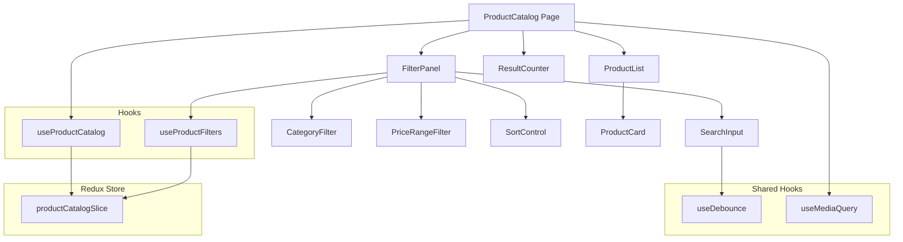
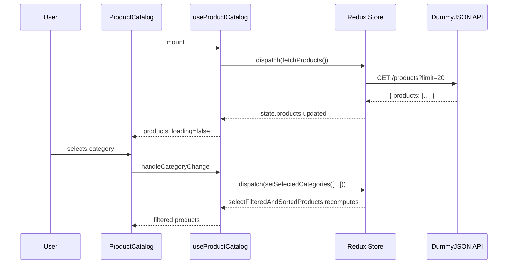

# Design Document: Product Catalog

## Overview

The Product Catalog feature is a client-side React module that fetches 20 products from the DummyJSON API and provides interactive filtering, sorting, and search capabilities. All data manipulation (filtering, sorting, searching) happens client-side after the initial fetch, meaning the full dataset lives in the Redux store and derived views are computed via selectors.

Key design decisions:

- **Single fetch, client-side filtering**: Since we only load 20 products, performing all filtering/sorting/searching in memory is simpler and faster than making repeated API calls.
- **Redux Toolkit for state**: The product data, loading state, filter criteria, sort option, and search query all live in a single Redux slice. This provides predictable state transitions and easy debugging.
- **Custom hooks as the logic layer**: Components remain thin and focused on rendering. All state access, dispatch calls, and derived computations are encapsulated in feature-specific hooks.
- **Debounced search**: Search input uses a 300ms debounce to avoid excessive re-renders while typing.

## Architecture



### Data Flow

1. `ProductCatalog` mounts → dispatches `fetchProducts` async thunk
2. API response stored in `productCatalogSlice` as the raw product array
3. User interactions dispatch filter/sort/search actions to update slice state
4. A memoized selector (`selectFilteredAndSortedProducts`) computes the visible products from raw data + active filters
5. Components re-render with the derived product list



## Components and Interfaces

### File Structure

```
src/
├── features/
│   └── product-catalog/
│       ├── ProductCatalog.tsx          # Main container component
│       ├── ProductList.tsx             # Grid of product cards
│       ├── ProductCard.tsx             # Individual product display
│       ├── FilterPanel.tsx             # Container for all filter controls
│       ├── CategoryFilter.tsx          # Category checkbox group
│       ├── PriceRangeFilter.tsx        # Min/max price inputs
│       ├── SortControl.tsx             # Sort dropdown
│       ├── SearchInput.tsx             # Debounced text search
│       ├── ResultCounter.tsx           # "N product(s) found" display
│       ├── useProductCatalog.ts        # Hook: fetch, loading, error, products
│       ├── useProductFilters.ts        # Hook: filter/sort/search state & handlers
│       ├── productCatalogSlice.ts      # Redux slice + selectors
│       ├── productCatalogService.ts    # API call function
│       ├── productCatalog.types.ts     # TypeScript types
│       └── index.ts                    # Barrel exports
├── shared/
│   └── hooks/
│       ├── useDebounce.ts              # Generic debounce hook
│       └── useMediaQuery.ts            # Responsive breakpoint hook
└── app/
    └── store.ts                        # Redux store config
```

### Component Interfaces

```typescript
// ProductCatalog.tsx — Main container
// Orchestrates layout, fetches data on mount, applies responsive breakpoints
export function ProductCatalog(): JSX.Element;

// ProductList.tsx
interface ProductListProps {
  products: Product[];
  columns: 1 | 2 | 3;
}

// ProductCard.tsx
interface ProductCardProps {
  product: Product;
}

// FilterPanel.tsx
// Renders all filter controls. No props — uses useProductFilters hook internally.
export function FilterPanel(): JSX.Element;

// CategoryFilter.tsx
interface CategoryFilterProps {
  categories: string[];
  selectedCategories: string[];
  onCategoryChange: (category: string) => void;
}

// PriceRangeFilter.tsx
interface PriceRangeFilterProps {
  min: number;
  max: number;
  currentMin: number;
  currentMax: number;
  onMinChange: (value: number) => void;
  onMaxChange: (value: number) => void;
  error: string | null;
}

// SortControl.tsx
interface SortControlProps {
  currentSort: SortOption;
  onSortChange: (option: SortOption) => void;
}

// SearchInput.tsx
interface SearchInputProps {
  value: string;
  onChange: (value: string) => void;
}

// ResultCounter.tsx
interface ResultCounterProps {
  count: number;
}
```

### Hook Interfaces

```typescript
// useProductCatalog — manages fetch lifecycle and provides filtered data
interface UseProductCatalogReturn {
  products: Product[];
  filteredProducts: Product[];
  isLoading: boolean;
  error: string | null;
  columns: 1 | 2 | 3;
}

// useProductFilters — manages all filter/sort/search state
interface UseProductFiltersReturn {
  categories: string[];
  selectedCategories: string[];
  priceRange: { min: number; max: number };
  currentPriceRange: { min: number; max: number };
  priceError: string | null;
  sortOption: SortOption;
  searchQuery: string;
  handleCategoryChange: (category: string) => void;
  handleMinPriceChange: (value: number) => void;
  handleMaxPriceChange: (value: number) => void;
  handleSortChange: (option: SortOption) => void;
  handleSearchChange: (value: string) => void;
}

// useDebounce — generic debounce utility
function useDebounce<T>(value: T, delay: number): T;

// useMediaQuery — responsive breakpoint detection
function useMediaQuery(query: string): boolean;
```

### Service Interface

```typescript
// productCatalogService.ts
interface FetchProductsResponse {
  products: ApiProduct[];
  total: number;
  skip: number;
  limit: number;
}

function fetchProductsFromApi(
  signal?: AbortSignal,
): Promise<FetchProductsResponse>;
```

## Data Models

### API Response Types (raw from DummyJSON)

```typescript
// What comes back from the API — we only extract fields we need
interface ApiProduct {
  id: number;
  title: string;
  description: string;
  category: string;
  price: number;
  discountPercentage: number;
  rating: number;
  stock: number;
  brand: string;
  thumbnail: string;
  images: string[];
  // ... many other fields we don't use
}
```

### Application Types

```typescript
// Our trimmed-down product model
interface Product {
  id: number;
  title: string;
  price: number;
  category: string;
  rating: number;
}

type SortField = "price" | "rating";
type SortDirection = "asc" | "desc";

interface SortOption {
  field: SortField | null;
  direction: SortDirection;
}

// Predefined sort options for the dropdown
type SortOptionKey =
  | "default"
  | "price-asc"
  | "price-desc"
  | "rating-asc"
  | "rating-desc";
```

### Redux State Shape

```typescript
interface ProductCatalogState {
  // Data
  products: Product[];

  // Loading
  status: "idle" | "loading" | "succeeded" | "failed";
  error: string | null;

  // Filters
  selectedCategories: string[];
  priceRange: {
    min: number;
    max: number;
  };

  // Sort
  sortOption: SortOption;

  // Search
  searchQuery: string;
}
```

### Selector Pipeline

The core filtering logic is implemented as a memoized selector that applies filters in sequence:

```typescript
// selectFilteredAndSortedProducts
// 1. Start with all products
// 2. Filter by selected categories (if any selected)
// 3. Filter by price range (min <= price <= max)
// 4. Filter by search query (case-insensitive title substring match)
// 5. Sort by selected field and direction (stable sort preserving API order for ties)
```

## Correctness Properties

_A property is a characteristic or behavior that should hold true across all valid executions of a system — essentially, a formal statement about what the system should do. Properties serve as the bridge between human-readable specifications and machine-verifiable correctness guarantees._

### Property 1: Product mapping preserves required fields

_For any_ valid API product object containing id, title, price, category, and rating fields, mapping it to the application Product type SHALL produce an object with identical values for all five fields and no extraneous fields.

**Validates: Requirements 1.3**

### Property 2: Price formatting produces correct currency string

_For any_ non-negative number, the price formatter SHALL produce a string matching the pattern `$X.XX` where X.XX is the input rounded to exactly two decimal places.

**Validates: Requirements 2.2**

### Property 3: Rating formatting produces correct display string

_For any_ number between 0 and 5 (inclusive), the rating formatter SHALL produce a string matching the pattern `X.X/5` where X.X is the input rounded to exactly one decimal place.

**Validates: Requirements 2.3**

### Property 4: Category extraction is unique and alphabetically sorted

_For any_ array of products, extracting categories SHALL produce a list where each category appears exactly once and the list is sorted in ascending alphabetical order.

**Validates: Requirements 3.1**

### Property 5: Category filter returns exactly matching products

_For any_ array of products and any non-empty set of selected categories, filtering by category SHALL return exactly those products whose category is a member of the selected set — no matching products excluded, no non-matching products included.

**Validates: Requirements 3.2**

### Property 6: Price range filter returns exactly products within bounds

_For any_ array of products and any min/max pair where min <= max, filtering by price range SHALL return exactly those products where min <= price <= max.

**Validates: Requirements 4.1, 4.2, 4.3**

### Property 7: Default price range equals data bounds

_For any_ non-empty array of products, the default minimum price SHALL equal the lowest price in the array and the default maximum price SHALL equal the highest price in the array.

**Validates: Requirements 4.4**

### Property 8: Sort produces correctly ordered output with stable tie-breaking

_For any_ array of products and any sort option (price or rating, ascending or descending), the sorted output SHALL be ordered according to the selected field and direction, and products with equal values in the sorted field SHALL maintain their original relative order.

**Validates: Requirements 5.2**

### Property 9: Search filter returns exactly title-matching products

_For any_ array of products and any non-empty, non-whitespace search string, filtering by search SHALL return exactly those products whose title contains the search string as a case-insensitive substring.

**Validates: Requirements 6.1**

### Property 10: Result counter displays correct count format

_For any_ non-negative integer N, the result counter SHALL display the string "N product(s) found" with the exact numeric value of N.

**Validates: Requirements 7.1**

### Property 11: Combined filters apply AND logic

_For any_ array of products and any combination of active filters (selected categories, price range, search query), the combined filter result SHALL equal the intersection of applying each individual filter independently — a product appears in the result if and only if it passes ALL active filter criteria.

**Validates: Requirements 8.1**

## Error Handling

### API Fetch Errors

| Error Condition                 | Handling Strategy                          | User-Facing Message                                         |
| ------------------------------- | ------------------------------------------ | ----------------------------------------------------------- |
| Network error (no connectivity) | Catch in async thunk, store error in slice | "Unable to connect. Please check your internet connection." |
| HTTP error (4xx/5xx)            | Check `response.ok`, reject with status    | "Failed to load products. Please try again later."          |
| Timeout (>10 seconds)           | AbortController with 10s timeout           | "Request timed out. Please try again."                      |
| Invalid response format         | Validate response shape in service         | "Received unexpected data. Please try again."               |

### Abort Handling

- Each fetch uses an `AbortController`
- On component unmount, the abort signal cancels any in-flight request
- On remount, a fresh controller and fetch are created
- Aborted requests do not update state (thunk condition or abort error check)

### Input Validation Errors

| Input                       | Validation                                | Behavior                                                 |
| --------------------------- | ----------------------------------------- | -------------------------------------------------------- |
| Price min/max — non-numeric | Reject at input level, don't update state | Input remains at previous valid value                    |
| Price min > max             | Detect in hook, set error state           | Display inline error message, do not apply invalid range |
| Price negative value        | Constrain min to 0                        | Clamp to 0, update normally                              |
| Search — whitespace only    | Treat as empty                            | Show all products (no filter applied)                    |

### Graceful Degradation

- If products load but have missing fields, the mapping function provides safe defaults (empty string for title, 0 for price/rating, "unknown" for category)
- If the product list is empty after successful fetch, display "No products available" message
- If combined filters result in zero matches, display "No products match your current filters" message

## Testing Strategy

### Property-Based Tests (fast-check)

The project will use [fast-check](https://github.com/dubzzz/fast-check) for property-based testing. Each property from the Correctness Properties section maps to a single property-based test with a minimum of 100 iterations.

**Property tests target the pure logic layer:**

- `productCatalogSlice.ts` — reducers and selectors (filtering, sorting, mapping)
- `productCatalogService.ts` — response mapping function
- Formatting utilities (price, rating, result counter)

**Configuration:**

- Minimum 100 iterations per property
- Each test tagged with: `Feature: product-catalog, Property {N}: {title}`

**Test file:** `src/features/product-catalog/productCatalog.property.test.ts`

### Unit Tests (Vitest + React Testing Library)

Unit tests cover specific examples, edge cases, and component rendering:

- **Component rendering**: ProductCard renders all fields, empty states display correctly
- **Integration points**: Hooks dispatch correct actions, selectors return expected shapes
- **Edge cases**: Empty product list, all filters active with no matches, min > max validation
- **Debounce behavior**: Search updates after 300ms (fake timers)
- **Lifecycle**: Fetch on mount, abort on unmount

**Test file:** `src/features/product-catalog/productCatalog.test.tsx`

### Integration Tests

- Full filter pipeline: mount ProductCatalog with mocked API, apply filters, verify rendered output
- Responsive layout: verify column count changes at breakpoints using mock matchMedia

### Test Libraries

- **Vitest** — test runner
- **React Testing Library** — component rendering and assertions
- **fast-check** — property-based testing (minimum 100 iterations per property)
- **MSW (Mock Service Worker)** — API mocking for integration tests
